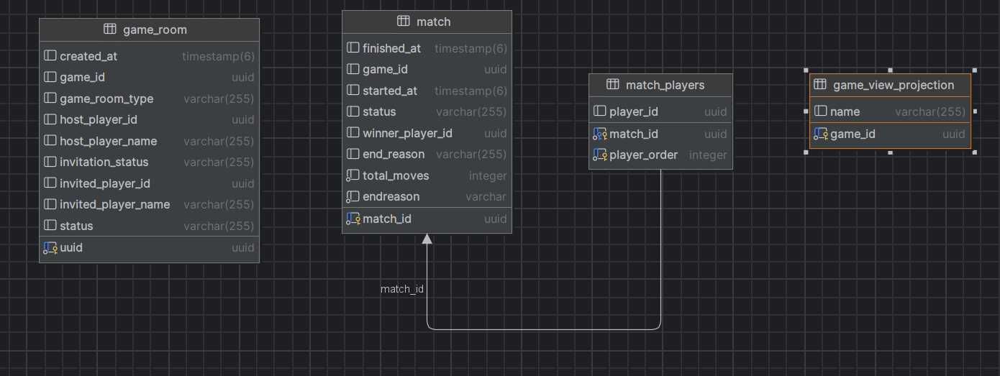
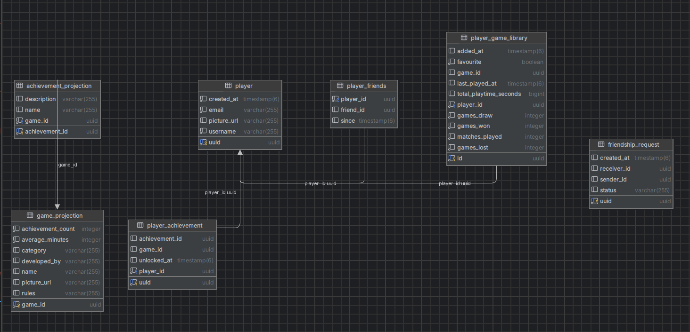
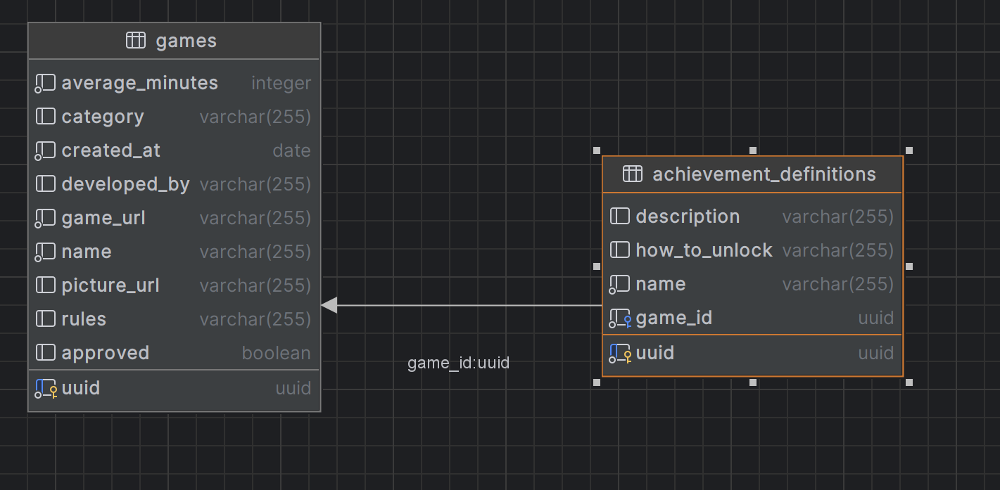

# OG Platform - Backend

## Overview
Spring Boot backend application for the OG (Online Gaming) Platform. This service manages user authentication, game integration, player profiles, friendships, and game room orchestration.

## Features
- User registration and authentication via Keycloak
- Player profile management
- Friendship system (send/accept/reject friend requests)
- Game library management
- Game room creation and invitation system
- Real-time WebSocket communication for game events
- RabbitMQ integration for asynchronous messaging
- Achievement tracking system

## Architecture

### Modules
The application follows a modular hexagonal architecture:

1. **Common**: Shared configurations (RabbitMQ, CORS, etc.)
2. **Security**: Authentication and authorization
3. **Platform**: Game catalog management
4. **Player**: Player profiles, friendships, game libraries
5. **Gameplay**: Game rooms, match orchestration, invitations

### Database Schema
##### Gameplay:

##### Player:

##### Platform:
